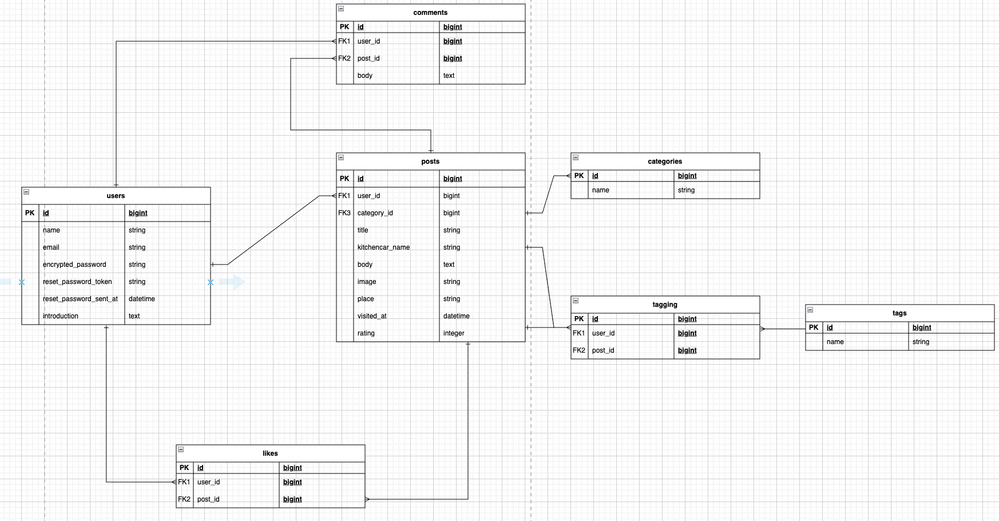

# README

## プロジェクト名：「キッチンカーアプリ」

## 目次
- [サービス概要](#-サービス概要)
- [サービスURL](#-サービスurl)
- [このサービスへの思い・作りたい理由](#このサービスへの思い・作りたい理由)
- [ユーザー層について](#ユーザー層について)
- [ユーザーの獲得について](#ユーザーの獲得について)
- [サービスの利用イメージ](#サービスの利用イメージ)
- [機能紹介](#機能紹介)
- [サービスの差別化ポイント・推しポイント](#サービスの差別化ポイント推しポイント)
- [使用技術](#使用技術)
  - [画面遷移図](#画面遷移図)
  - [ER図](#ER図)
- [技術的に工夫した点](#技術的に工夫した点)

## サービス概要
キッチンカーを利用した体験を共有できるレビュー投稿アプリです。
「どのキッチンカーが美味しかったか」「どんな体験ができたか」を投稿・閲覧することで、キッチンカーの魅力を発信します。

## サービスURL
#### https://kitchencardiary.com/

## このサービスへの思い・作りたい理由
私はクレープが好きなのですが、近くに専門店がなく、気軽に食べられる場所がありません。
そんな中で、街で偶然見つけるキッチンカーのクレープはとても嬉しく、ちょっとしたご褒美のように感じます。
しかし「今日はどこに出店しているのか」が分からず、せっかく食べたいと思っても出会えないことが多くありました。
同じように「キッチンカーに行きたいけれど、出店場所や雰囲気が分からない」という人は多いのではないかと思います。
そこで、実際に利用した人の体験談やレビューを共有できるアプリを作れば、 
  ・「美味しそう！」「雰囲気が楽しそう！」とイメージがわきやすくなる 
  ・行ったことがない人も安心して利用できる 
  ・キッチンカー運営者にとっても口コミで新しいお客さんと出会える 
という価値が生まれると考えました。
このアプリを通じて、キッチンカーの魅力をもっと多くの人に伝えたいと思っています。

## ユーザー層について
・キッチンカーをよく利用する人 
・どのキッチンカーに行くか迷っている人 
・自分の食体験を発信したい人 

## ユーザーの獲得について
MVP段階では開発者自身がレビューを投稿し、デモ用のコンテンツを用意します。
その後、友人や知人に実際に使ってもらい、フィードバックを集めて改善していく予定です。

## サービスの利用イメージ
1.ユーザーはアプリに登録し、実際に利用したキッチンカーのレビューを投稿します。
（例：写真を添えて「このタコスがとても美味しかった！」と紹介） 
2.他のユーザーは一覧からレビューを閲覧し、気になるキッチンカーを見つけることができます。 
3.まだ行ったことがないユーザーも、リアルな体験談を読むことで「行ってみたい！」という気持ちを持つことができます。

## 機能紹介
| ユーザー登録 / ログイン |
| :---: | 
| [Gyazoで操作動画を見る](https://gyazo.com/005f49ac33043064749e9713580c8384)
| 
『名前』『メールアドレス』『パスワード』『確認用のパスワード』を入力してユーザー登録を行います。 また、Googleアカウントを用いてGoogleログインを行う事も可能です。
 |

| 投稿の新規作成 |
| :---: | 
| [Gyazoで操作動画を見る](https://gyazo.com/005f49ac33043064749e9713580c8384)
| 
『タイトル』や『キッチンカーの名前』など必要な情報を入力することで投稿を行うことができます。 また、Google Mapで視覚的にキッチンカーの場所をピン留めすることが可能です。
 |

| いいね機能 |
| :---: | 
| [Gyazoで操作動画を見る](https://gyazo.com/8d4b53f06411f166df11d614f5aa5487)
| 
いいねした投稿一覧ををプロフィールで確認することができます。
 |

| 検索機能 |
| :---: | 
| [Gyazoで操作動画を見る](https://gyazo.com/f439570631eafcd6b7ad47459514e357)
| 
『タグ』や『キーワード』、『カテゴリー』で検索することでお目当ての投稿を探しやすくなります。
 |

## サービスの差別化ポイント・推しポイント
既存サービス（例: SHOP STOP）は「出店場所や時間の検索」に強いが、「利用者の体験」を共有する仕組みは弱い。

本サービスは利用者が実際に感じた美味しさや雰囲気をレビュー投稿できる点に強みがある。
→ 初めての人でも「このお店はどんな雰囲気？」「味はどう？」が分かりやすくなる。

## 使用技術

#### 開発言語 / フレームワーク
- Ruby 3.2.3
- Ruby on Rails 8.1.2

#### フロントエンド
- Bootstrap 5
- JavaScript (ES6)
- Stimulus / Turbo

#### 認証
- Devise

#### データベース
- PostgreSQL 14

#### 画像アップロード
- Active Storage

#### デプロイ
- Render

#### 開発ツール / CI
- Docker
- GitHub Actions
- RuboCop
- RSpec

#### 外部サービス・API
- Cloudinary（Active Storageの保存先として使用）
- Google Maps JavaScript API（キッチンカー出店場所の地図表示）
- Google OAuth（Devise + OmniAuth による Google ログイン）

### 画面遷移図
https://www.figma.com/design/5UjfxzfBvbbEZAhdaLLzdj/%E5%8D%92%E6%A5%AD%E5%88%B6%E4%BD%9C%E3%80%80%E7%94%BB%E9%9D%A2%E9%81%B7%E7%A7%BB%E5%9B%B3?node-id=0-1&t=WFZ5oRLMQ6BA6boV-1

### ER図

## 技術的に工夫した点

#### 1. Google Maps API を用いた出店場所の可視化
キッチンカーの出店場所を直感的に把握できるよう、Google Maps JavaScript API を導入しました。  
投稿作成時に地図上でピンを立てることで、文章だけでは分かりにくい位置情報を視覚的に表現しています。

#### 2. Active Storage + Cloudinary による画像管理
投稿画像の保存先として Cloudinary を利用し、Active Storage と連携させました。  
これにより、低コストで本番環境でも安定した画像配信が可能となりました。

#### 3. Devise + Google OAuth によるログイン体験の向上
ユーザー登録のハードルを下げるため、Devise に加えて Google OAuthを導入しました。  
メールアドレス登録だけでなく、Google アカウントによる簡単なログインを可能にしています。
